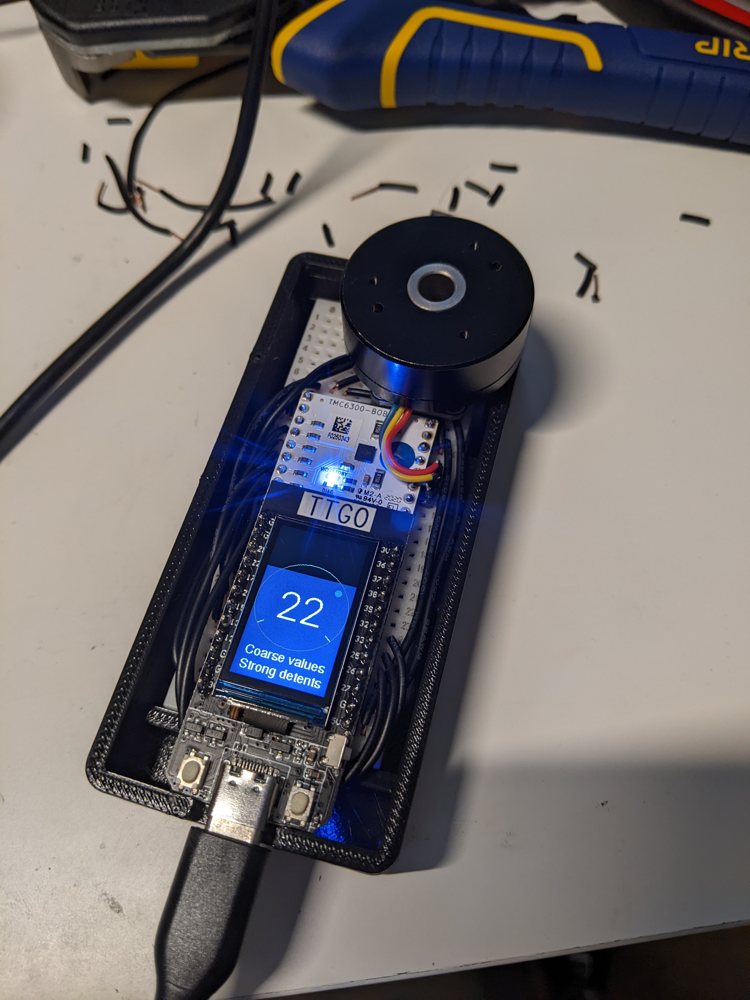
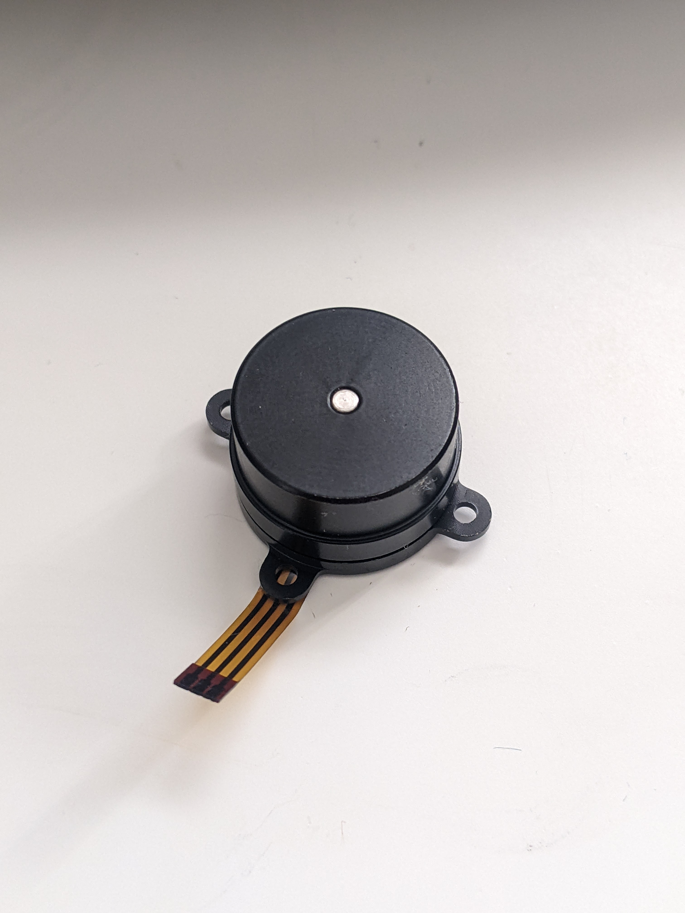
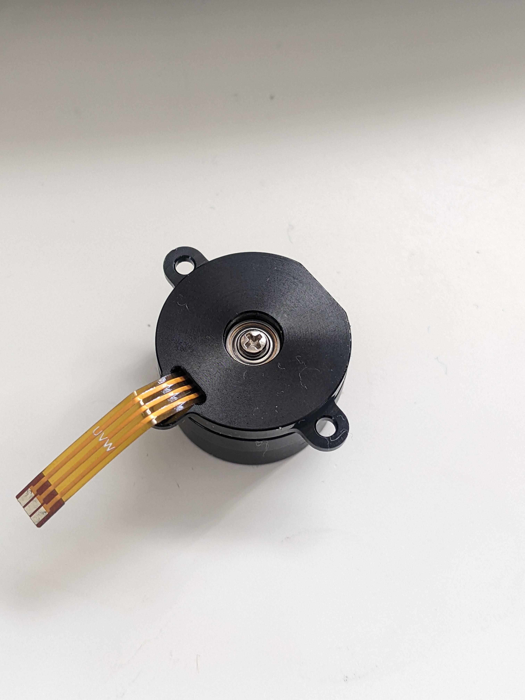

# SmartKnob

Coming soon...

# Hardware

## Designs

### SmartKnob View
Premium SmartKnob experience. Under active development.

Not recommended for general use yet (mechanical and electrical revisions are planned).

Requires advanced soldering experience to build - reflow and small-pitch SMT soldering are required.

Features:
 - Powered by ESP32-PICO-V3-02 (Lilygo TMicro32 Plus module)
 - 240x240 round LCD, protected by 39.5mm watch glass on rotor
 - PCB flexure and strain gauges used for press detection (haptic feedback provided via the motor)
 - 8 side-firing RGB LEDs (SK6812-SIDE-A) illuminate ring around the knob
 - USB C (2.0) connector for 5V power and serial data/programming (CH340)
 - VEML7700 ambient light sensor for automatic backlight & LED intensity adjustment
 - Versatile back plate for mounting - use either 4x screws, or 2x 3M medium Command strips for mounting
 - Front cover snaps on for easy access

#### Demo video

#### Exploded view

#### Base PCB

Note: use white soldermask, for reflecting light from RGB LED ring around the knob.

[Schematic](https://smartknob-artifacts.s3.us-west-1.amazonaws.com/master/electronics/view_base-schematic.pdf)

[Interactive BOM](https://smartknob-artifacts.s3.us-west-1.amazonaws.com/master/electronics/view_base-ibom.html)

[PCB Packet](https://smartknob-artifacts.s3.us-west-1.amazonaws.com/master/electronics/view_base-pcb-packet.pdf)

[Gerbers](https://smartknob-artifacts.s3.us-west-1.amazonaws.com/master/electronics/view_base-jlc/gerbers.zip)

#### Screen PCB

[Schematic](https://smartknob-artifacts.s3.us-west-1.amazonaws.com/master/electronics/view_screen-schematic.pdf)

[Interactive BOM](https://smartknob-artifacts.s3.us-west-1.amazonaws.com/master/electronics/view_screen-ibom.html)

[PCB Packet](https://smartknob-artifacts.s3.us-west-1.amazonaws.com/master/electronics/view_screen-pcb-packet.pdf)

[Gerbers](https://smartknob-artifacts.s3.us-west-1.amazonaws.com/master/electronics/view_screen-jlc/gerbers.zip)

### SmartKnob Handheld
An exploration of a small handheld form-factor. Under active development.

### SmartKnob Mini
Planned for the future.

## Component Info

### Magnetic encoders

#### MT6701 (MagnTek)
Excellent sensor at a reasonable price - highly recommended. Less noisy than TLV493D, and more responsive (control loop is more stable) using SSI.

 - Lots of IO options - SSI, I2C, and ABZ - should offer good response latency
 - SSI includes CRC to validate data
 - No power-down or low-power options - may not be ideal for battery-powered devices
 - Not available from US distributors (Mouser, Digi-Key)

[Datasheet](http://www.magntek.com.cn/upload/MT6701_Rev.1.5.pdf)

[Ordering (LCSC)](https://lcsc.com/product-detail/Angle-Linear-Position-Sensors_Magn-Tek-MT6701CT-STD_C2856764.html)

#### TLV493D (Infineon)
A mediocre choice. Easy to prototype with using [Adafruit's QWIIC breakout board](https://www.adafruit.com/product/4366).

In my testing, it is a little noisy, requiring filtering/smoothing that can slow responsiveness, hurting control loop stability. Or, with less filtering, the noise
can easily be "amplified" by the derivative component in the PID motor torque controller, causing audible (and tactile) humming/buzzing.

There is also apparently a known silicon issue that causes the internal ADC to sometimes completely lock up, requiring a full reset and re-configuration. See section
5.6 in the [User Manual](https://www.infineon.com/dgdl/Infineon-TLV493D-A1B6_3DMagnetic-UM-v01_03-EN.pdf?fileId=5546d46261d5e6820161e75721903ddd)

    In the Master Controlled Mode (MCM) or the Fast Mode (FM) the ADC conversion may hang up. A hang up can
    be detected by:
     - Frame Counter (FRM) counter stucks and does not increment anymore.

In my experience testing 4 different Adafruit breakout boards, 2 of them (50%) regularly exhibit this lockup behavior within a minute or two of use. It is possible to detect and auto-reset (and there is code in the project to do so), but it is slow and may cause undesirable jumps/delays if the sensor locks up often.

[Datasheet](https://www.mouser.com/datasheet/2/196/Infineon_TLV493D_A1B6_DataSheet_v01_10_EN-1227967.pdf)

#### 

### Motor drivers
#### TMC6300-LA
This is a relatively new IC and it's a perfect match! There generally aren't any other drivers (with integrated fets) that meet the requirements for the low-voltage and low-current motors used in this project (DRV8316 might work, but has not been tested).

Highlights:
 - 2-11V DC motor supply input
 - Up to 1.2A RMS
 - Tiny (3x3mm QFN)

 [Datasheet](https://www.trinamic.com/fileadmin/assets/Products/ICs_Documents/TMC6300_datasheet_rev1.07.pdf)

 [Product page](https://www.trinamic.com/products/integrated-circuits/details/tmc6300-la/)

### Motors
#### 32mm Rotor, Hollow Shaft, Diametric magnet

- 32mm rotor
- 15mm overall height (including magnet), 12.75mm height w/o magnet, 9mm rotor height
- low/zero cogging - excellent for completely smooth input
- 5.9mm hollow shaft
- built-in diametric magnet for encoder
- Proven option

This is overall the easiest motor to get started with. Low cogging and a built-in diametric magnet are great!

[AliExpress](https://www.aliexpress.com/item/1005001384349991.html)

#### ~17mm Rotor

- Not tested yet
- Stepped 17.3mm and 16.3mm diameter rotor
- 11.2mm total height, 8.6mm rotor height
- moderate cogging - not ideal for completely smooth input
- Rotor has threaded hole on the side that should be usable for keying a cap
- Very little shaft accessible on bottom - may be tricky to mount a diametric magnet to it. Maybe could replace screw with something else?

[AliExpress](https://www.aliexpress.com/item/1005003240145615.html)

# Firmware
TODO

# Acknowledgements
This project was greatly inspired by Jesse Schoch's video "[haptic textures and virtual detents](https://www.youtube.com/watch?v=1gPQfDkX3BU)" and the
corresponding [discussion in the SimpleFOC community](https://community.simplefoc.com/t/haptic-textures/301).

# License

This project is licensed under Apache v2 (see [LICENSE.txt](LICENSE.txt)).

    Copyright 2022 Scott Bezek
    
    Licensed under the Apache License, Version 2.0 (the "License");
    you may not use this file except in compliance with the License.
    You may obtain a copy of the License at
    
        http://www.apache.org/licenses/LICENSE-2.0
    
    Unless required by applicable law or agreed to in writing, software
    distributed under the License is distributed on an "AS IS" BASIS,
    WITHOUT WARRANTIES OR CONDITIONS OF ANY KIND, either express or implied.
    See the License for the specific language governing permissions and
    limitations under the License.

