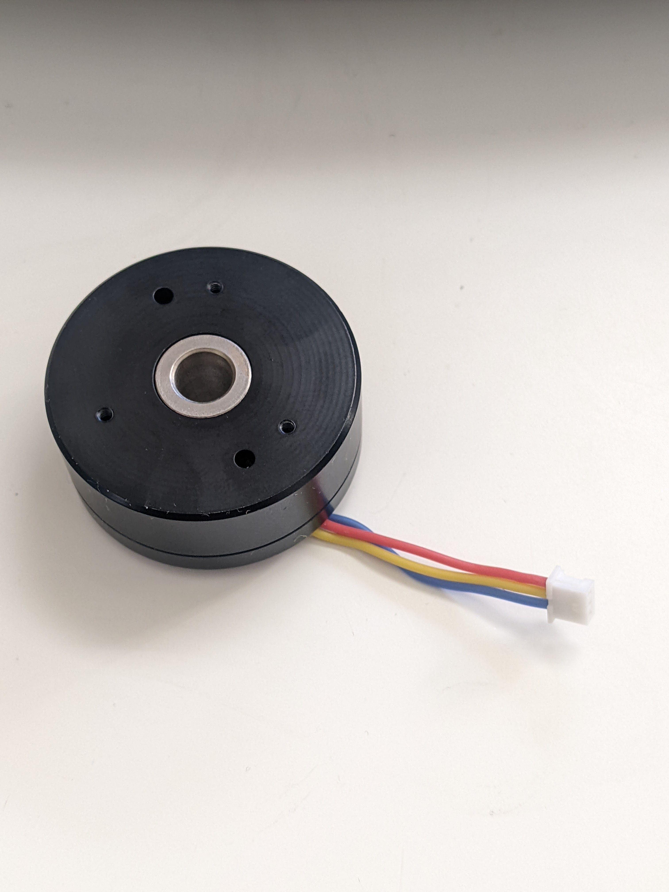
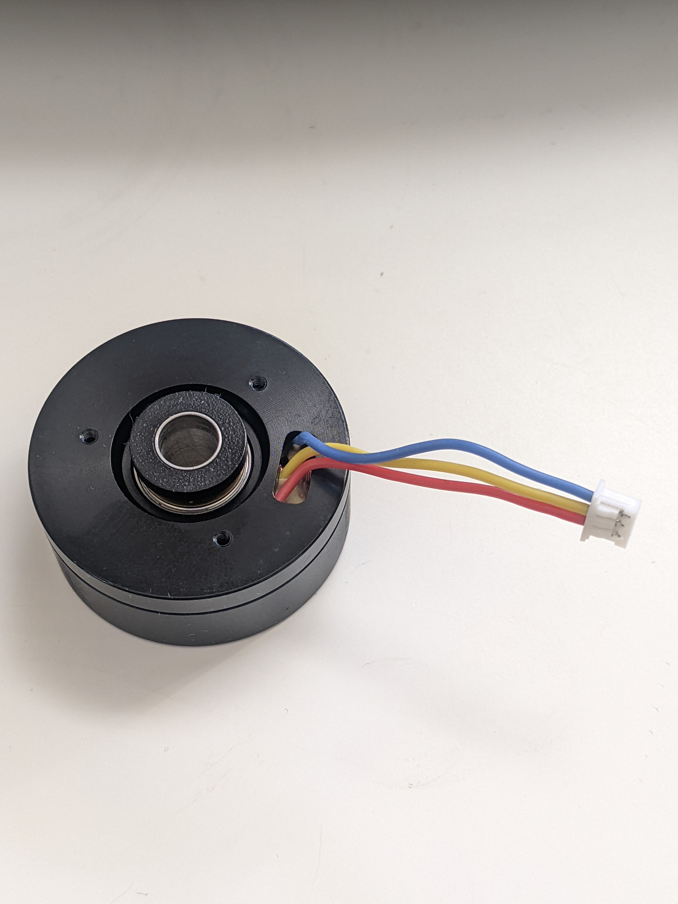

# SmartKnob
SmartKnob is an open-source input device with software-configurable endstops and virtual detents.

A brushless gimbal motor is paired with a magnetic encoder to provide closed-loop torque feedback control, making it
possible to dynamically create and adjust the feel of detents and endstops.

Join the [Discord community](https://discord.gg/5jyhjcbTnR) to discuss the project with others, show off your build, or help answer each others' questions!

# Designs

## SmartKnob View
The "SmartKnob View" is the premium SmartKnob experience with an integrated display shown in my [demo video](https://www.youtube.com/watch?v=ip641WmY4pA). Under active development.

🎉 **Motors are [now available](https://www.sparkfun.com/products/20441)!** If you've been following this project,
you'll know that the recommended motors went out of stock nearly immediately after it was published.
Thanks to [the community](https://github.com/scottbez1/smartknob/issues/16#issuecomment-1094482805%5D), we were able to
identify the likely original manufacturer, and recently SparkFun Electronics has been getting them produced and regularly
[stocking them](https://www.sparkfun.com/products/20441)! (However, they've been selling out quickly each time they restock, so definitely sign up for backorder notifications if they're out of stock when you check). Thanks to everyone who helped search and investigate different
motor options along the way!

Features:
 - 240x240 round LCD ("GC9A01"), protected by 39.5mm watch glass on rotor
 - BLDC gimbal motor, with a hollow shaft for mechanically & electrically connecting the LCD
 - Powered by ESP32-PICO-V3-02 (Lilygo TMicro32 Plus module)
 - PCB flexure and SMD resistors used as strain gauges for press detection (haptic feedback provided via the motor)
 - 8 side-firing RGB LEDs (SK6812-SIDE-A) illuminate ring around the knob
 - USB-C (2.0) connector for 5V power and serial data/programming (CH340)
 - VEML7700 ambient light sensor for automatic backlight & LED intensity adjustment
 - Versatile back plate for mounting - use either 4x screws, or 2x 3M medium Command strips (with cutouts for accessing removal tabs after installation)
 - Front cover snaps on for easy access to the PCB

**Current status:** Not recommended for general use, but may be a fun project for an advanced electronics hobbyist.

### Demo video

### How it works

### 3D CAD

Latest Fusion 360 Model: https://a360.co/3BzkU0n

#### DEMO: video editor timeline control

If you edit audio/video, imagine having a jog wheel where you could _feel_ the clip boundaries as you scrolled through the timeline. Then switch to playback speed control, with a wheel that's spring-loaded to return to "paused," with snaps at 1x, 2x, 4x, etc. The SmartKnob can do this; it just needs some software integrations to be written. Check out a demo using a SmartKnob prototype to control a mock video timeline:

(you can actually try this demo yourself if you've already built a SmartKnob; plug it in over USB and go to https://scottbez1.github.io/smartknob/)

### Build your own?

While this is a "DIY" open-source project, it is not yet a mature plug-and-play project. If you intend to build your own, note that it requires advanced soldering experience to build - very small-pitch surface-mount soldering is required (reflow or hot air recommended), and assembly is quite time-consuming and delicate. Please go into it with the expectation that you will almost certainly need to be able to troubleshoot some hardware and firmware issues yourself - I recommend reviewing/understanding the schematics and basic firmware before jumping in!

More documentation on the BOM and what parts you need to order is coming in the future - thanks so much for your interest! Follow me on [Twitter](https://twitter.com/scottbez1) for the latest updates on this and other projects.

View the latest auto-generated (untested) [Base PCB Interactive BOM](https://smartknob-artifacts.s3.us-west-1.amazonaws.com/master/electronics/view_base-ibom.html) and [Screen PCB Interactive BOM](https://smartknob-artifacts.s3.us-west-1.amazonaws.com/master/electronics/view_screen-ibom.html) (or, the combined [BOM csv](https://smartknob-artifacts.s3.us-west-1.amazonaws.com/master/electronics/view_base-bom.csv)) for electronics/hardware parts list. ⚠️ These are auto-generated from the latest untested revision on GitHub. For tested/stable/recommended artifacts, use a [release](https://github.com/scottbez1/smartknob/releases) instead.

A few miscellaneous notes in the meantime:

 - There's limited space inside the LCD mount for wiring, and 8 wires need to fit through the hole in the center. I used 30 AWG wire-wrapping wire. Enamel-coated wire would probably work too.
 - Older versions of the design (as seen in the videos) used glued-on BF350-3AA strain gauges to detect presses; in v0.5 these were replaced with footprints for SMD resistors, which exhibit similar properties when stretched/compressed and are much easier to assemble. 
 - The TMC6300 is _tiny_ and has a bottom pad, so I would seriously consider getting a stencil along with the PCB order. Even with the stencil I needed to manually clean up some bridging afterward; I _highly_ recommend Chip Quik NC191 gel flux, available on [Amazon](https://amzn.to/3MGDSr5) (or use this [non-affiliate link](https://www.amazon.com/Smooth-Flow-No-Clean-syringe-plunger/dp/B08KJPG3NZ) instead) or from your electronics distributor of choice. Flux is also very helpful when soldering the LCD ribbon cable to to screen PCB.
 - For breadboard prototyping, the [TMC6300-BOB](https://www.trinamic.com/support/eval-kits/details/tmc6300-bob/) or SparkFun's [TMC6300 driver board](https://www.sparkfun.com/products/21867) are awesome and way easier to work with than the bare chip if you just want to play around with low current BLDC motors
 - For AliExpress purchases: I highly recommend **only** using AliExpress Standard Shipping (purchasing in the US). I have had multiple purchases take months or never get delivered when purchased with Cainiao or other low cost shipping options, whereas AliExpress Standard is very reliable and generally faster in my experience.
 - Make sure to check the [open issues](https://github.com/scottbez1/smartknob/issues) - this design is not yet "stable", so beware that everything may not go smoothly.

Future plans:
 - consider switch to using an ESP32-S3-MINI-1 module
 - get wifi configured and working (probably MQTT?). Currently memory is an issue with the full display framebuffer sprite. PSRAM might fix this (requires newer ESP-IDF & unreleased Arduino core, and from a brief test I got horrible performance with PSRAM enabled), or the next item might help reduce memory:
 - migrate to LVGL, for better display rendering and easy support for menus, etc. Shouldn't require a full 240x240x24b framebuffer in memory, freeing some for wifi, etc.
 - Home Assistant integration, or other real-world applications
 - ???
 - [Profit](https://github.com/sponsors/scottbez1/) 😉

#### Already built one?
Check out the [firmware/software documentation](https://paper.dropbox.com/doc/SmartKnob-firmware-and-software--B_oWj~L1dXqHgAqqYmhwwuqzAg-VUb9nq7btuhnHw5KlgJIH)
for tips on getting it programmed and hooking it up to your own software integrations.

If you've already uploaded the standard firmware and gone through the calibration process (see guide linked above if you don't know what this means),
go to https://scottbez1.github.io/smartknob/ to try out an interactive web-based demo that uses Web Serial to talk to a SmartKnob that's plugged into your
computer's USB port!

#### Base PCB

Ordering notes: use white soldermask, for reflecting light from RGB LED ring around the knob. Should be 1.2mm thick (not "standard" 1.6mm).

If you are ordering a stencil for solder paste from JLCPCB and plan to apply paste by hand (as
[shown in the video](https://youtu.be/Q76dMggUH1M?t=372)) without a stencil frame/machine, make sure to select
**"Customized size"** and enter smaller dimensions (e.g. 100mm x 100mm) to avoid getting a much larger stencil than you
need. This will also likely reduce the cost of shipping substantially! Also, select only the **Top** side; the bottom
only has 2 SMT components - the motor connector and VEML7700 ALS - so it's not worth getting a stencil for that.

Latest auto-generated (untested and likely broken!) artifacts⚠️:

[Schematic](https://smartknob-artifacts.s3.us-west-1.amazonaws.com/master/electronics/view_base-schematic.pdf)

[Interactive BOM](https://smartknob-artifacts.s3.us-west-1.amazonaws.com/master/electronics/view_base-ibom.html)

[PCB Packet](https://smartknob-artifacts.s3.us-west-1.amazonaws.com/master/electronics/view_base-pcb-packet.pdf)

[Gerbers](https://smartknob-artifacts.s3.us-west-1.amazonaws.com/master/electronics/view_base-jlc/gerbers.zip)

⚠️ For tested/stable/recommended artifacts, use a [release](https://github.com/scottbez1/smartknob/releases) instead.

#### Screen PCB

Ordering notes: Must be 1.2mm thick (not "standard" 1.6mm) per mechanical design. (The PCB silkscreen mentions 0.6mm thickness - this is the thickness of the **VHB tape** for adhering the LCD; the PCB should be 1.2mm thick)

There are few enough components on the Screen PCB that I chose to hand-solder them rather than reflow with solder paste
and a stencil, but if you order a stencil, see the note above about selecting a "Customized size" to be easier to
handle and save on shipping. Also make sure to select the **Bottom** side only; all the components are on the bottom
side of the screen PCB.

Latest auto-generated (untested and likely broken!) artifacts⚠️:

[Schematic](https://smartknob-artifacts.s3.us-west-1.amazonaws.com/master/electronics/view_screen-schematic.pdf)

[Interactive BOM](https://smartknob-artifacts.s3.us-west-1.amazonaws.com/master/electronics/view_screen-ibom.html)

[PCB Packet](https://smartknob-artifacts.s3.us-west-1.amazonaws.com/master/electronics/view_screen-pcb-packet.pdf)

[Gerbers](https://smartknob-artifacts.s3.us-west-1.amazonaws.com/master/electronics/view_screen-jlc/gerbers.zip)

⚠️ For tested/stable/recommended artifacts, use a [release](https://github.com/scottbez1/smartknob/releases) instead.

#### Printed parts
You will need six printed parts. The current stable designs can be found as STL assets in the [v185 mechanical release](https://github.com/scottbez1/smartknob/releases/tag/releases%2Fmechanical%2Fv185-dummy-tag) or you can export the latest untested designs from the CAD model by opening it in Fusion 360: https://a360.co/3BzkU0n

The parts can _probably_ be FDM 3D printed with a well-tuned printer, but the parts shown in videos/photos were MJF printed in nylon for tight tolerances and better surface finish. 

If you wanted a simpler build, you could omit the LCD and just merge the knob + glass from the model into a single STL to get a closed-top knob.

Export and print the following 6 parts:
* `Enclosure`
* `Knob` (RotorAssembly->KnobAssembly->Knob)
* `ScreenPlatform`
* `RotorSpacer` (RotorAssembly->RotorSpacer)
* `MountBase`
* `BackPlate`

⚠️ If you opt to go for MJF Nylon printing from JLCPCB, their system may complain about `< 0.8mm wall thickness detected` on the `MountBase`, `ScreenPlatform` and `RotorSpacer` parts. This appears to be a false positive, possibly on some of the print tapers. You should be able to ignore this, as all print orders at JLCPCB are subject to a final manual review, and they will contact you by email if there are any job-stopping issues or risks with your prints.

## NanoFOC (3rd party)
If you're looking to tinker with FOC/haptic feedback, but don't want to build a full SmartKnob View yourself, I can
recommend the NanoFOC DevKit++, an [open-source design](https://github.com/katbinaris/nanofoc_devkit) made and
[sold](https://store.binaris.io/products/nanofoc-devkit) by a member of the SmartKnob community! It's super compact
and is a great testbed or core for building your own BLDC-based haptic input device.

The NanoFOC uses an ESP32-S3, and the SmartKnob firmware works on it out of the box; just select the `nanofoc`
environment in PlatformIO rather than the `view` environment when uploading.

# Frequently Asked Questions (FAQ)

### Can I use this cheap gimbal BLDC motor I found on AliExpress?

I can't stop you, but I will caution that **you probably won't be super happy with it** depending on your intended application.

Nearly every off-the-shelf BLDC gimbal motor that the community has tested (which is pretty much ALL the cheap ones you'll find on AliExpress, trust me) has
_moderate to severge cogging_. That means the motor wants to snap to certain positions by itself even when unpowered. This means you won't be able to get
completely smooth rotation when virtual detents are turned off, and the motor's cogging may interfere with or overpower the virtual detents, particularly if
you set them to lower strength or make then very fine-grained.

The recommended motor is definitely the best (i.e. lowest cogging) off-the-shelf motor we've come across so far, and is the only readily-available motor
that I would consider "good" for this application.

If you've found another motor that is completely smooth when unpowered, we'd LOVE to hear about it in the discord; if you're wondering about some cheap motor
you saw online, either just order one and try it for yourself, or ask about it in discord but don't be surprised (or offended) if the response you get is
something terse like "nope, no good".

### How much does it cost?

I wish I could tell you now, but I don't actually know off the top of my head. Check back soon - I've only built a few so far, which was the result of a bunch of tinkering and prototyping over an extended period, so I don't have all the expenses tallied up yet. Probably less than $200 in parts? But some items have gotten more expensive, and you may be limited by minimum order quantities or shipping charges from multiple separate suppliers.

### Does it work with XYZ?

Not yet, regardless of whatever "XYZ" you're thinking of. So far I've only implemented enough firmware for the demo shown in the video, so you can't actually use it for anything productive yet. The basic detent configuration API is there, but not much else. Lots of firmware work remains to be done. If you build one, I'd love your help adding support for "XYZ" though!

### Can I buy one as a kit or already assembled?

Probably not? Or at least, I don't have any immediate plans to sell them myself. It's not that I don't want you to be happy, but hardware is a hard business and I just work on this stuff in my free time.

It's open source with a fairly permissive license though, so in theory anyone could start offering kits/assemblies. If someone does go down that route of selling them, note that attribution is
 _required_ (and I wouldn't say no to [royalties/tips/thanks](https://github.com/sponsors/scottbez1/) if you're in a giving mood 🙂).

# Firmware and Software
More extensive documentation of the firmware and software (and how to get started) can be found in the dedicated [SmartKnob Firmware and Software Guide](https://paper.dropbox.com/doc/SmartKnob-firmware-and-software--Byho6npe9XvZLZLxJ_8bK5TqAg-VUb9nq7btuhnHw5KlgJIH#:h2=Calibration)

## General Component Info

### Magnetic encoders

#### MT6701 (MagnTek)
Excellent sensor at a reasonable price - highly recommended. Less noisy than TLV493D, and more responsive (control loop is more stable) using SSI.

 - Lots of IO options - SSI, I2C, and ABZ - should offer good response latency
 - SSI includes CRC to validate data
 - No power-down or low-power options - may not be ideal for battery-powered devices
 - Not available from US distributors (Mouser, Digi-Key)

[Datasheet](http://www.magntek.com.cn/upload/MT6701_Rev.1.5.pdf)

[Ordering (LCSC)](https://lcsc.com/product-detail/Angle-Linear-Position-Sensors_Magn-Tek-MT6701CT-STD_C2856764.html)

#### TLV493D (Infineon)
Not used in the SmartKnob view, but a common/popular magnetic encoder in general. It's a mediocre choice for a haptic feedback implementation. Easy to prototype with using [Adafruit's QWIIC breakout board](https://www.adafruit.com/product/4366).

In my testing, it's noisy, requiring filtering/smoothing that can slow responsiveness, hurting control loop stability. Or, with less filtering, the noise
can easily be "amplified" by the derivative component in the PID motor torque controller, causing audible (and tactile) humming/buzzing.

But the bigger issue is that there is apparently a known silicon issue that causes the internal ADC to sometimes completely lock up, requiring a full reset and re-configuration, which can cause delays/gaps in data! See section
5.6 in the [User Manual](https://www.infineon.com/dgdl/Infineon-TLV493D-A1B6_3DMagnetic-UM-v01_03-EN.pdf?fileId=5546d46261d5e6820161e75721903ddd)

    In the Master Controlled Mode (MCM) or the Fast Mode (FM) the ADC conversion may hang up. A hang up can
    be detected by:
     - Frame Counter (FRM) counter stucks and does not increment anymore.

In my experience testing 4 different Adafruit breakout boards, 2 of them (50%) regularly exhibit this lockup behavior within a minute or two of use. It is possible to detect and auto-reset (and there is code in the project to do so), but it is slow and may cause undesirable jumps/delays if the sensor locks up often.

[Datasheet](https://www.mouser.com/datasheet/2/196/Infineon_TLV493D_A1B6_DataSheet_v01_10_EN-1227967.pdf)

#### AS5600 (AMS)
A mediocre choice. Cheap breakout boards are readily available.

In my testing, it's fairly noisy (anecdotally, noisier than the TLV493d), requiring filtering/smoothing that can slow responsiveness, hurting control loop stability. Additionally, it saturates at a lower magnetic field strength than other sensors I tested, requiring a significant air gap (8-10mm) when used with a strong neodymium diametric magnet like [Radial Magnets 8995](https://www.digikey.com/en/products/detail/radial-magnets-inc/8995/5126077).

[Datasheet](https://ams.com/documents/20143/36005/AS5600_DS000365_5-00.pdf)

### Motor drivers
#### TMC6300-LA
This is a relatively new IC and it's a perfect match! There generally aren't any other drivers (with integrated fets) that meet the requirements for the low-voltage and low-current motors used in this project (DRV8316 might work, but has not been tested).

Highlights:
 - 2-11V DC motor supply input
 - Up to 1.2A RMS
 - Tiny (3x3mm QFN)

 [Datasheet](https://www.trinamic.com/fileadmin/assets/Products/ICs_Documents/TMC6300_datasheet_rev1.07.pdf)

 [Product page](https://www.trinamic.com/products/integrated-circuits/details/tmc6300-la/)

### Motors
#### 32mm Rotor, Hollow Shaft, Diametric magnet

- 32mm rotor
- 15mm overall height (including magnet), 12.75mm height w/o magnet, 9mm rotor height
- low/zero cogging - excellent for completely smooth input
- 5.9mm hollow shaft
- built-in diametric magnet for encoder
- Proven option

This is overall the easiest motor to get started with. Low cogging and a built-in diametric magnet are great!

Available [from SparkFun](https://www.sparkfun.com/products/20441)!

# Acknowledgements
This project was greatly inspired by Jesse Schoch's video "[haptic textures and virtual detents](https://www.youtube.com/watch?v=1gPQfDkX3BU)" and the
corresponding [discussion in the SimpleFOC community](https://community.simplefoc.com/t/haptic-textures/301). Seriously, this project wouldn't exist if not for that video - thank you Jesse!

# License

This project is licensed under Apache v2 (software, electronics, documentation) and Creative Commons Attribution 4.0 (hardware/mechanical) (see [LICENSE.txt](LICENSE.txt) and [Creative Commons](https://creativecommons.org/licenses/by/4.0/)).

    Copyright 2022 Scott Bezek
    
    Licensed under the Apache License, Version 2.0 (the "License");
    you may not use this file except in compliance with the License.
    You may obtain a copy of the License at
    
        http://www.apache.org/licenses/LICENSE-2.0
    
    Unless required by applicable law or agreed to in writing, software
    distributed under the License is distributed on an "AS IS" BASIS,
    WITHOUT WARRANTIES OR CONDITIONS OF ANY KIND, either express or implied.
    See the License for the specific language governing permissions and
    limitations under the License.

